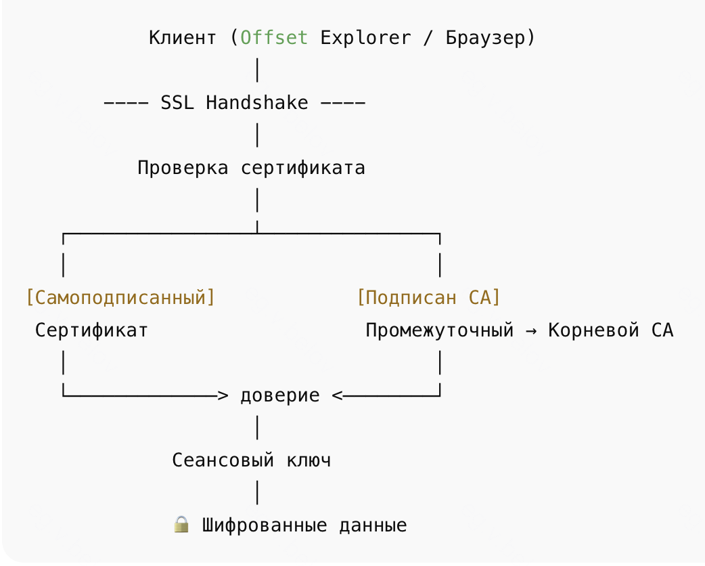

### Локальный запуск приложения

- очень часто, чтобы внести какие-то изменения при деплое на тест, необходимо протестировать приложение локально:
	-  прогнать тесты, проверить настройки подключения, какой-либо функционал не покрывающийся тестами
	- для того чтобы это выполнить зачастую используются локальные конфиги, дублирующие или измененные относительно продовых и тестовых конфигов, чтобы была возможность управлять настройками не трогая текущие на тесте и проде
- в JVM есть такое понятие как **classpath** - логическое пространство, набор местоположений/источников, которое **JVM** и **spring** используют для поиска различных ресурсов
	-  .class файлы 
	-  ресурсы (.yml, .properties, .xml, и т.д.)
	- Примеры элементов classpath:
		- директории (target/classes)
	    - JAR-файлы (app.jar, spring-core.jar)
- **Spring** читает конфиги примерно следующим образом `getClass().getClassLoader().getResourceAsStream("application.yml");`
- Тогда почему конфиги мы располагаем по пути `src/main/resources/application.yml`?
	- потому что при сборке и компиляции проекта сборщики `maven/gradle` 
	- рассматривают `src/main/resources` как каталог ресурсов 
	- копируют его содержимое в выходную директорию сборки (target/classes или build/resources/main)
	- а эта директория включается в classpath JVM
- как подменить директорию для расположения `application.yml`?
	- указать в системе сборки `build.gradle` или `pom.xml` - не рекомендуется, потому что тогда это полетит в удаленный репозиторий и затем будет использоваться при деплое 
	- основной вариант - указать в настройках IDE аргумент для локального запуска:
		- рядом с кнопкой запуска/debug нажать `три точки рядом(1)` или на саму `конфигурацию(2)`
	    - нажать `edit(1)` / `edit configuration(2)`
	    - там в `invironment variables` указать аргумент `--spring.config.location` а в качестве значения путь до `application.yml ` например `bev/bev_application.yaml` 
		    - путь указывается относительно относительно того пути, что указан в working directory
		    - вместо `--spring.config.location` можно написать `SPRING_CONFIG_LOCATION`
		- что произойдет?
		- в случае когда мы указали `--spring.config.location` idea при запуске передаст это как аргумент для JVM `java ... --spring.config.location=bev/bev_application.yaml
		- в случае когда мы указали `SPRING_CONFIG_LOCATION` idea выполняет однократный запуск команды с переменной `SPRING_CONFIG_LOCATION=bev/bev_application.yaml java -jar build/libs/app.jar`
		- **Spring Boot** проверяет источники в таком порядке
			1. Аргументы командной строки (`--spring.config.*`) 
			2. SPRING_APPLICATION_JSON (json-строка)
			3. Переменные окружения (`SPRING_CONFIG_LOCATION`) - специальная переменная, можно использовать вместо `application.yml`
			4. `application.properties` / `application.yml` в classpath
			5. `application.properties` / `application.yml` в текущей директории (working dir)
			6. Любые профили / дополнительные location, прописанные через `spring.config.additional-location`
		- находит наш подмененный config, поэтому то что указано в `src/main/resources` уже не имеет значения
### Сертификаты и как они связаны с локальным запуском


- Любое сетевое соединение с любым сервером начинается с установки TCP соединения (обычно на 443 порте)
	1. Клиент -> сервер SYN - отправляет серверу запрос для синхронизации, чтобы корректно читать ответы друг друга(опустим как)
	2. Сервер -> клиент: SYN-ACK - сервер подтверждает и отправляет также запрос для синхронизации
	3. Клиент -> сервер ACK - клиент подтверждает серверу что все получил
- После установки соединение поверх настраивается SSL/TLS (новый Transport Layer Security - устаревший Secure Sockets Layer) - шифрование
	- происходит похожий как в случае TCP - SSL/TLS Handshake
	1.  ClientHello - клиент говорит серверу, что умеет шифровать, и отправляет случайные данные.
	2. ServerHello -  сервер выбирает алгоритмы шифрования, отправляет свой сертификат.
	3. Проверка сертификата - клиент проверяет, что сертификат сервера доверенный (сравнивает с truststore).
	4. Обмен ключами - с помощью сертификата сервер и клиент договариваются о сеансовом ключе, который будет использоваться для шифрования данных.
	5. Secure Communication - дальше данные шифруются этим ключом.
- Далее по установленному зашифрованному соединению по какому либо протоколу передачи данных передаются данные между клиентом и сервером. если используется HTTP поверх TLS - это HTTPS
- Все это работает всегда и везде, так почему же мы руками нигде не указываем никакие сертификаты и где проверяется пункт 3.
- truststore - это хранилище доверенных сертификатов, залезая в которые мы видим, что сертификат отправленный сервером находится среди набора доверенных сертификатов CA (Certificate Authority - Центр сертификации), которым можно доверять - это позволяет понять, что клиент общается с тем сервером на котором расположен сайт/ресурс по типу gosuslugi.ru на который клиент хотел зайти и этот сервер не подменен. Сертификат может быть подписан напрямую корневым центром сертификации (CA) или другим сертификатом — промежуточным (Intermediate CA), который, в свою очередь, подписан следующим сертификатом, и так далее по цепочке, пока она не дойдёт до корневого CA, находящегося в доверенном хранилище клиента, а это зачастую является самоподписанным сертификатом центра сертификации, который лежит в хранилище как надежный
	- сертификат содержит имя хоста DNS (по типу gosuslugi.ru)
	- клиент шифрует что-то с помощью публичного ключа который получил вместе с сертификатом (есть разные способы)
	- сервер получает обратно и расшифровывает его с помощью своего приватного ключа
	- если приватный ключ слит, то любой другой сервер сможет подтвердить что он именно тот самый сервер который связан сайтом gosuslugi.ru)
	- помимо того что необходимо чтобы был слит ключ, надо как-то также подменить ip который возвращается при запросе в цепочке
	- Очень упрощенно: Ты (браузер / приложение) -> Твой интернет-провайдер -> DNS-сервер провайдера) -> DNS интернета -> IP сайта ()
	- Открытые wi-fi сети как раз в этом могут помочь (хз как, может потом прочитаю)
- то есть с помощью сертификата только проверяется что тот к кому мы подключается это надежный ресурс (тебе можно доверять), а затем с помощью приватного ключа, что ты действительно владелец данного сертификата
- у любого устройства есть свое хранилище сертификатов CA с каким-то наиболее широким/полным набором этих сертификатов, поэтому нам никакие сертификаты руками не надо никуда класть, когда мы шастаем по сайтам например
- Когда возникают проблемы?
- Kafka часто разворачивается внутри организации, с самоподписанными сертификатами. Их нет в системном хранилище доверенных CA → нужно вручную добавить truststore (например файл произвольное_имя.jks в случае offset explorer) для подключение к ней или вовсе скачать и установить какой-то .cer  локально на свой ноут
- Многие ресурсы используют SSL с сертификатами, подписанными широко доверенными CA (такими, сертификаты которых уже есть в системе). В случае БД Банка думаю все таки какие-то сертификаты лежат на компе в локальном хранилище (которые сохранили при выдаче ноутбука) без отдельного truststore, поэтому ничего делать не надо
#### Локальный запуск
- Из практики, если при локальном запуске если указать в качестве хостов кафки адреса с тестового контура, то при создании бина consumer/producer упадет в ошибку
- почему?
- у JVM есть свой truststore в котором очевидно нет сертификатов серверов, на которых развернута kafka, поэтому в качестве аргумента application.yaml надо указать для нее путь к jks - java key store
- пример
```yaml
kafka:  
  producer:  
    bootstrap.servers: ${INVEST_KAFKA_SERVERS}  
    key.serializer: org.apache.kafka.common.serialization.StringSerializer  
    value.serializer: org.apache.kafka.common.serialization.StringSerializer  
    security:  
      protocol: SASL_SSL  
    sasl:  
      mechanism: SCRAM-SHA-512  
      jaas:  
        config: org.apache.kafka.common.security.scram.ScramLoginModule required username="${INVEST_KAFKA_USER}" password="${INVEST_KAFKA_PASSWORD}";  
    ssl:  
      truststore:  
        location: bev/explorer-truststore.jks  
        password: 12345678
```
тогда в коде это будет выглядеть так
```java
@Configuration  
@EnableConfigurationProperties({  
        KafkaConfiguration.KafkaProperties.class  
})  
public class KafkaConfiguration {  
  
    @Getter  
    @Setter    @ConfigurationProperties(value = "app.kafka")  
    public static class KafkaProperties {  
        private final Map<String, String> producer = new HashMap<>();  
        private String outputTopic;  
        private int retryInterval;  
        private int maxFailures;  
    }  
  
    @Bean  
    public KafkaTemplate<String, String> producerKafkaTemplate(KafkaProperties properties) {  
        Map<String, Object> configs = new HashMap<>(properties.getProducer());  
        DefaultKafkaProducerFactory<String, String> kafkaProducerFactory = new DefaultKafkaProducerFactory<>(configs);  
        return new KafkaTemplate<>(kafkaProducerFactory);  
    }  
}
```